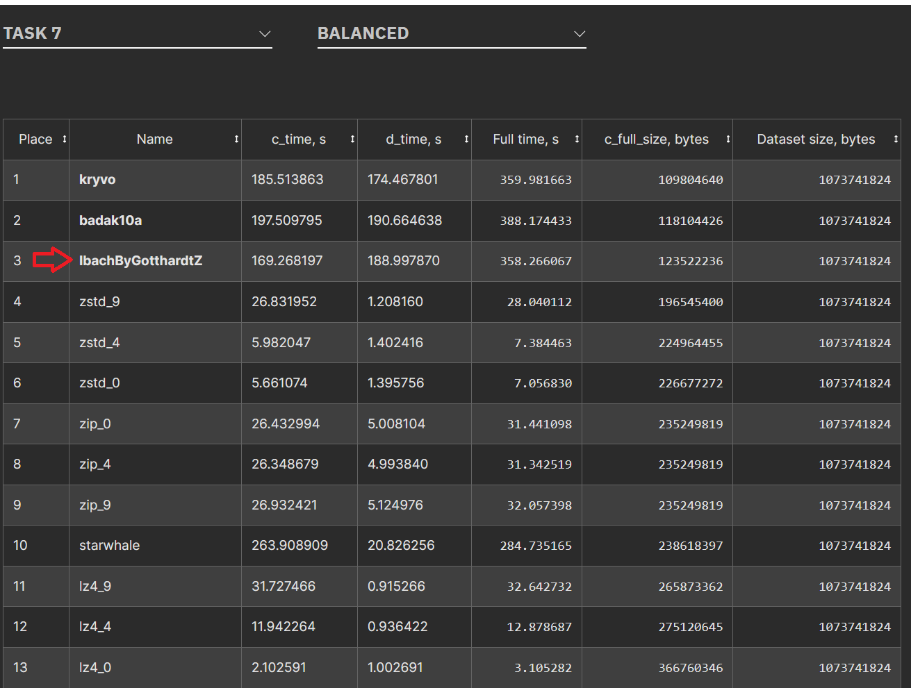

# lpaq2g-ibach file compressor: a GDCC 2023 submission for Task 7 ("Compression of Mixed Data")

This is the source code of my Task 7 submission for [GDCC (Global Data Compression Competition) 2023](https://gdcc.tech/).

See also the very similar [lpaq2g-wiese](https://github.com/GotthardtZ/lpaq2g-wiese) compressor which was submitted for Task 5 ("Compression of Qualitative Data").

# The Name

The first part of the name 'lpaq2g-ibach' originates from one of its predecessor, lpaq2, with a suffix 'g' which stands for  'GDCC'.

As a tradition in GDCC, submitted compressors have fantasy names. For task 7 I chose 'Ibach' and for Task 5 I chose 'Wiese' which are the names of two small rivers in Switzerland near my home.

# What's included?
- C++ Source code
- Build script for MinGW-W64 (./build-windows.cmd)
- Build script for Linux (./build-linux.sh)
- Visual Studio 2017 solution

## Contest Rules

See [GDCC 2023 'Rules'](https://gdcc.tech/rules) page

lpaq2g-ibach was submitted to GDCC 2023 in the 'Balanced' speed category where the compression + decompression time limit was set to 400s for a given 1 GB test file.

This test file ('mixed_v2.dat') consists of several segments of xml and pdf data. Some xml segments are actually csv, other segments are full sentences, some are contents from excel spreadsheets. The pdf portion has several images and other embedded content.

## The Solution

lpaq2g-ibach is a single-thread context mixing compressor based on the following (also experimental context-mixing) compressors:

- lpaq2 - developed by Matt Mahoney and Alexander Rhatushnyak (https://mattmahoney.net/dc/)
- mcm - developed by Mathieu Chartier (https://github.com/mathieuchartier/mcm)
- paq8px - developed by Jan Ondrus and others (https://github.com/hxim/paq8px)

lpaq2g-ibach got it's source code structure from lpaq2 and was modified heavily to meet the runtime limit requirement of GDCC 2023. 

Many speed improvement ideas originate from mcm: the fast state update, the fast-track for matchmodel (aka lzp) and the idea of having a hashtable without collision-resolution.

Finally, the hashing functions, the state table and the token types (words, numbers and gaps) are from paq8px.

Additionally, it has the following notable novelties/extras:
- MatchModel: as a (cache-friendly) speedup optimization it verifies if the checksum of the match equals to the expected one before actually verifying the bytes to match.
- MatchModel: the matchmodel has a fast track (as in mcm), but we control entering fast-track mode based on two conditions: (1) the match length should exceed a threshold and (2) the probability that the match continues (with the predicted byte) should exceed another threshold. This improves not only the compression ratio but compression speed as well.
- I/O: buffered read and write (tiny speedup)

As with other context mixing compressors it processes the input file bit by bit, predicts each bit, then encodes (decodes) the actual bit using the predicted probability with an arithmetic encoder.

lpaq2g-ibach has:
- Five models. They are:
-- MatchModel (min match length: 8, max match length: 120),
-- Order-2 model,
-- Order-4 model,
-- Order-8 model and
-- Token model (modelling words, numbers, gaps)
- A mixer with 1 context set consisting of a combination of the following states as mixer contexts (resulting in 8*4*4*3 = 384 individual mixer contexts):
-- bit count (0-7),
-- quantized match length (0-3),
-- quantized token length (0-3) and 
-- token type (0-2)

It has:
- No block detection (segmentation) - if it would have, both compression ratio and time could have been improved
- No dictionary pre-processing - if it would have, both compression ratio and time could have been improved
- No second mixer layer - it wouldn't fit within the runtime limit
- No SSE stage - it wouldn't fit within the runtime limit
- No specialized models for xml, pdf, images, audio, etc. - the test file had several images in the pdf section, so with image models most likely both compression ratio and time could have been improved

## Memory use

Fixed 595 MB.
Memory usage breakdown by model (only the most significant ones are listed):
- 256 MB for MatchModel byte history (ring buffer)
- 64 MB for MatchModel hashtable (each hashtable item has an index to previous match, 16-bit checksum and a match probability represented as a state byte)
- 256 MB common hashtable for the order-4, order-8 and token models
- 16 MB hashtable for the order-2 model

The provided source code matches the program version submitted to GDCC 2023 except for a buffer overrun issue which was fixed in the meantime.

Note that GDCC 2023 rules specifically allowed the solution to be fine tuned for the test files or even contain hard-coded parts. 

The selected models and model parameters were chosen to perform well on  the 'Mixed Dataset' within the given time limit on the evaluation platform, however this compressor is still generic - it can be used to compress any file (< 2 GB).

## How to use

to compress: 

    lpaq2g-ibach.exe c input compressed_output [-lzpMinMatchLen=0 -lzpMinP=3350]

to decompress:

    lpaq2g-ibach.exe d compressed_input decompressed_output [-lzpMinMatchLen=0 -lzpMinP=3350]

...where the optional parameter values (for -lzpMinMatchLen and -lzpMinP) for decompression must match the ones supplied originally for compression.

Sensible threshold values for -lzpMinMatchLen are 0..16. This controls how many bytes of additional match are required for the MatchModel to enter into fast-track (lzp) mode. Setting this value to 0 means that the MatchModel needs no more than the initial 8-byte match, it can enter fast-track mode immediately.

Sensible threshold values for -lzpMinP are in the range of 2048..4000. This sets the minimum probability (scaled by 4096) for the MatchModel to enter into fast-track (lzp) mode. Thus, the value '3350' means that the fast-track mode will not kick in until the matchmodel reaches p=3350/4096=81.8% certainty that he next byte is the predicted one. It will also exit fast-track mode once the prediction falls below this limit.

The default settings (-lzpMinMatchLen=0 and -lzpMinP=3350) are optimal for the GDCC 2023 test file (mixed_v2.dat)

Note: the compressor has a 2 GB file limit.

# Results

    lpaq2g-ibach.exe c enwik8 enwik8.lpaq2g-ibach -lzpMinMatchLen=9 -lzpMinP=3980  

    lpaq2g-ibach.exe c enwik9 enwik9.lpaq2g-ibach -lzpMinMatchLen=9 -lzpMinP=3980  

    lpaq2g-ibach.exe c mixed_v2.dat mixed_v2.lpaq2g-ibach -lzpMinMatchLen=0 -lzpMinP=3350

|File|Original size | Compressed size | Compression time | Decompression time |
|---|---:|---:|---:|---:|
|enwik8| 100'000'000 | 20'403'800 | 31.6 s | 36.0 s |
|enwik9| 1'000'000'000 | 172'225'186 | 284.3 s | 324.2 s |
|mixed_v2.dat| 1'073'741'824 | 123'111'457 | 132.7 s | 149.2 s |

Above runtimes are measured on an Intel® Pentium® Gold G5600 Processor (4M Cache, 3.90 GHz), RAM: DDR4-2666 (1333MHz, dual channel).

Note that the parameters for enwik8 and enwik9 were selected to (roughly) minimize the compressed size of enwik8. By selecting different parameters one can find a balance between run time and compressed size or select different parameters for enwik9.

Preliminary GDCC 2023 results:

Note that 'c_full_size' = compressed file size + compressor size in bytes.

## License

Licensed under GPL, http://www.gnu.org/copyleft/gpl.html
